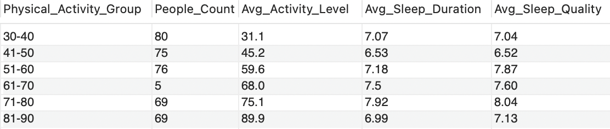

# Sleep_Quality_Analysis_SQL

## Project Summary
This project analyzes employee sleep patterns using SQL, highlighting how occupation, age, physical activity, gender, and BMI affect sleep quality and duration. The findings provide actionable insights for targeted wellness programs that improve employee well-being, reduce stress, and sustain productivity.

## Project Overview
This project examines employee sleep and wellness metrics to identify trends and insights across demographic and lifestyle factors.
The analysis uses SQL queries to evaluate sleep duration, sleep quality, stress levels, and their relationship with occupation, age, physical activity, gender, BMI, and sleep duration groups.
The goal is to support **data-driven decisions** for improving employee well-being and designing effective workplace wellness programs.

## Dataset
- Source: [Kaggle - Sleep Disorder Diagnosis Dataset](https://www.kaggle.com/datasets/varishabatool/disorder)  
- Format: CSV  
- Contents: Occupation, sleep duration, sleep quality, physical activity, stress level  
- Notes: No personally identifiable information included.  
- Dtat structure: 3,900 rows, 13 columns

## Analyses & Key Insights

### 1. Sleep Duration Analysis by Occupation
- **Purpose:** Evaluate average sleep duration by occupation and categorize individuals into `Warning / Normal / Good` based on ±1 hour deviation from the occupational average.
- **Insight:** Engineers sleep the longest (7.99h) with the lowest Warning rate (4.8%), while Nurses sleep less (7.06h) with the highest Warning count (14, 9.2%). Sales Representatives have the lowest sleep quality.  
  **→ Occupations with lower sleep quality or higher Warning rates may require targeted wellness programs.**
  

---

### 2. Age Group Sleep Comparison
- **Purpose:** Compare average sleep duration across age groups (20s, 30s, 40s, 50s, 60+) and identify differences from younger groups. 
- **Insight:** Employees in their 20s show the lowest average sleep duration and quality compared to other age groups

---

### 3. Physical Activity Level & Sleep Quality
- **Purpose:** Examine the relationship between physical activity levels and sleep quality/duration.
- **Insight:**
  - Generally, higher physical activity correlates with better sleep quality.
  - However, excessive activity (81–90) shows a slight decrease in sleep quality compared to (71–80), suggesting too much physical activity may negatively affect sleep duration and quality. **→ Wellness programs should encourage moderate activity levels for optimal sleep outcomes.**

---

### 4. Gender-Based Sleep Analysis
- **Purpose:** Compare sleep duration and quality between genders.  
- **Insight:** Women sleep longer and have higher sleep quality than men. Gender-specific wellness strategies may improve overall employee health.

---

### 5. BMI Category Analysis
- **Purpose:** Assess whether BMI category influences sleep duration, sleep quality, and stress level.
- **Insight:** Higher BMI groups show lower sleep quality and higher stress. **Wellness programs should integrate sleep improvement and weight management strategies.**

---

### 6. Sleep Duration Group Comparison
- **Purpose:** Segment employees into Short, Moderate, and Long sleep groups and compare wellness metrics. 
- **Insight:** Longer sleep duration is associated with higher sleep quality and lower stress. **Encouraging sufficient sleep can enhance overall wellness.**

---

## 🛠 Tech Stack
- SQL (CTE, Join, Case, Window Functions)  
- MySQL compatible queries

---

## Overall Portfolio Takeaways
- This analysis demonstrates that employee sleep quality and duration are meaningfully influenced by **occupation, age, physical activity level, gender, BMI, and sleep duration patterns,** highlighting the need for targeted rather than uniform wellness strategies.
- **Occupation:** Nurses exhibit higher sleep warning rates (9.2%) and lower average sleep duration compared to engineers, indicating elevated sleep deprivation risk in high-stress roles. Engineers and Nurses face high cognitive or physical demands, and insufficient sleep in these roles can lead to fatigue, reduced focus, and lower performance, impacting safety and productivity; **improving break schedules, staffing levels, and recovery-focused wellness support may help reduce burnout and sustain performance.**
- **Age:** Employees in their 50s show the highest sleep quality, while those in their 20s rank lowest, suggesting that companies could introduce **voluntary wellness initiatives tailored to younger employees, such as free after-work physical activity programs (light exercise, stretching, yoga) and stress management sessions.** Additionally, providing educational materials on sleep hygiene and creating a workplace culture that supports sufficient rest may help improve sleep duration and overall sleep quality.
- **Physical Activity:** Moderate-to-high activity levels (71–80) are associated with the best sleep outcomes, while excessive activity appears to negatively impact sleep duration and quality. Organizations should assess workload intensity by role or department and tailor **wellness programs accordingly providing relaxation and recovery-focused resources (such as stretching guides or relaxation exercises)** for employees engaged in physically demanding work, while **encouraging light cardio or strength training for employees with low physical activity levels to support balanced sleep outcomes.**
- **Gender:** Women show slightly higher sleep duration and quality, suggesting that **tailored wellness approaches addressing different recovery and stress patterns may be more effective than uniform programs.**
- **BMI:** Overweight and obese groups show reduced sleep quality and higher stress levels, highlighting potential health-related sleep risks. Wellness programs should combine sleep improvement with gradual weight-management support by introducing **low-intensity physical activities initially and progressively increasing exercise intensity to support sustainable weight loss and strength development.** Providing access to professional guidance or personalized check-ins can help ensure effectiveness while maintaining employee comfort and privacy.
- **Sleep Duration Groups:** Long sleepers report significantly higher sleep quality and lower stress, reinforcing the importance of sufficient sleep for overall well-being. Rather than focusing solely on increasing sleep duration, organizations should help employees identify **everyday factors that interfere with sleep—such as stress, workload, or recovery imbalance—and provide practical guidance on stress management, recovery routines, and healthy activity levels to improve sleep quality across the majority population.**
  
## Overall Conclusion
These findings suggest that **data-driven, role and lifestyle-aware wellness strategies** can help organizations proactively address sleep deprivation risks, improve employee well-being, and support sustainable productivity.

